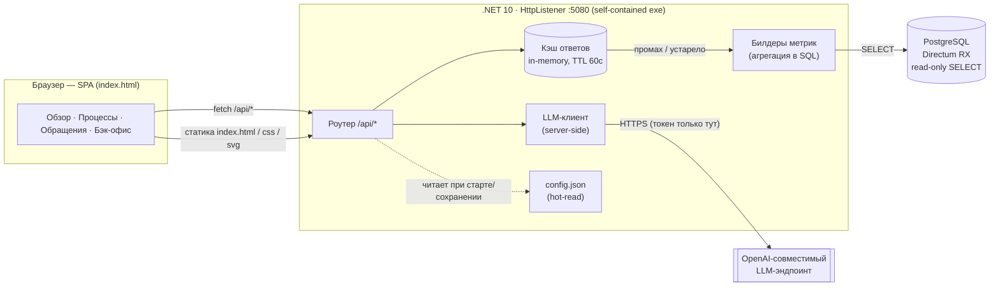
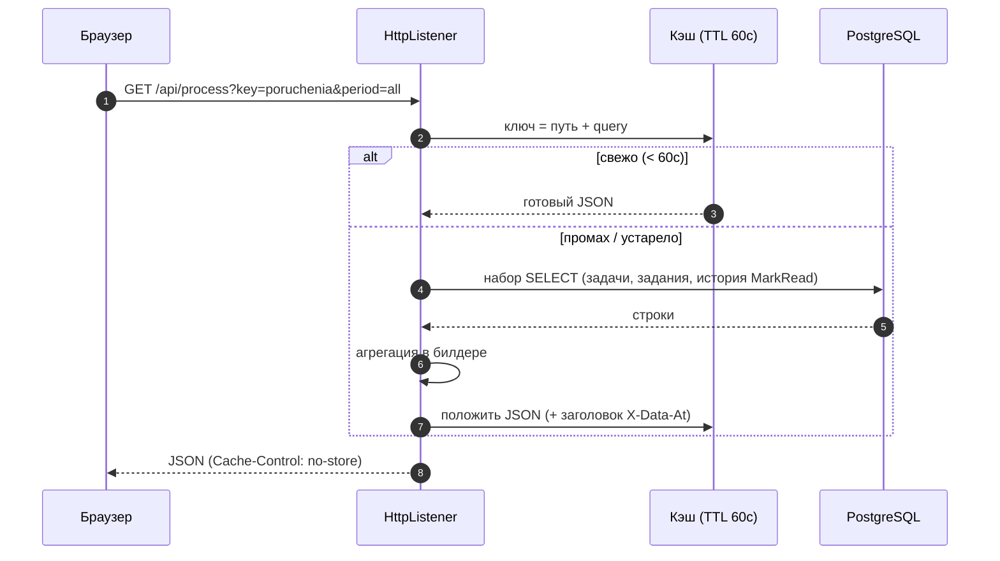
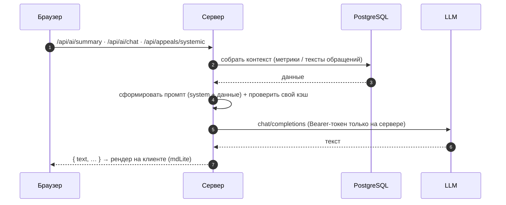
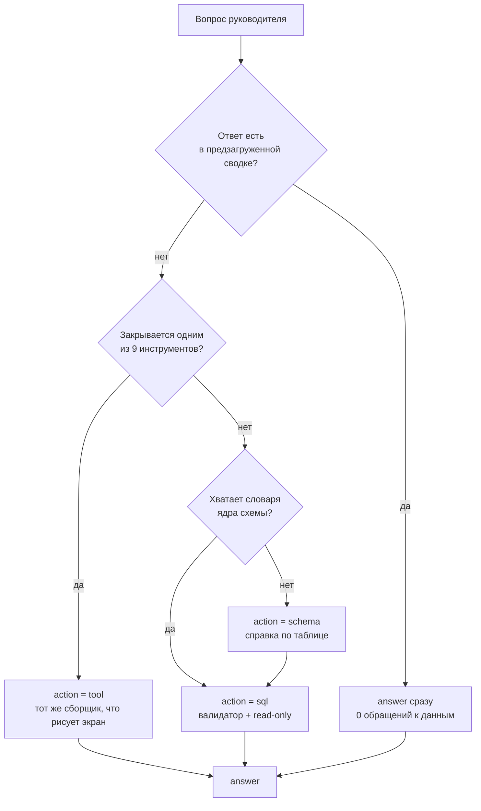
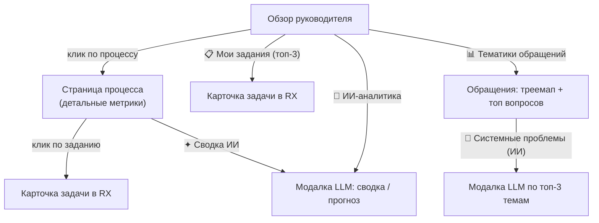

# АРМ руководителя — аналитика процессов (standalone)

Read-only веб-дашборд над БД Directum RX для первого лица: за 10 секунд понять состояние
процессов и провалиться в детали вплоть до конкретного поручения, исполнителя и ссылки в RX.
Поверх метрик — ИИ-сводка, чат, пояснения и разбор системных проблем по обращениям.
.NET 10, без установки в RX, **только `SELECT`**.

Охват: 3 процесса — **Поручения**, **Обращения граждан**, **НПА** — плюс сквозная аналитика тематик обращений.

---

## Как это работает

### Компонентная архитектура



### Поток запроса метрики (кэш перед БД)



### ИИ-сценарии (сводка / системные проблемы)



### Управляемая аналитика на Qwen

`POST /api/ai/analysis` по умолчанию запускает детерминированный workflow на
`Qwen/Qwen3.8-27B`: `prepare` → `plan` → `resolve_entities` → `dashboard_metric` или
`execute_sql` → `draft_report` → `validate_report`. Сервер задаёт порядок шагов, связывает
сотрудников с проверенными ID, применяет период и пропускает SQL через существующие
`SqlGuard`, `SqlScopePolicy` и `ReadOnlyExecutor`. Числа и графики отчёта принимаются только из
сохранённого `resultId`.

Runner выбирается явным `Analytics.Engine`: `workflow` — штатный режим, `legacy` — быстрый
откат на прежний `AnalysisAgent` с тем же `Qwen/Qwen3.8-27B`. Неизвестное значение
завершает запрос ошибкой `invalid_analytics_engine`; имя модели на выбор runner не влияет.
GigaChat или другая модель в снимке аналитики — `unsupported_analytics_model` до вызова
провайдера; тихого отката нет. Пресеты GigaChat в бэк-офисе остаются для чата дашборда.
Провайдерный адаптер анализа использует Ario `/v1/chat/completions`, Bearer token,
температуру `0.2` и `enable_thinking=false`. Пакет `Microsoft.Agents.AI.Workflows`
зафиксирован в `packages.lock.json`.

### Legacy ИИ-харнесс: свободный цикл действий

Обычный чат (схема выше) работает по принципу «весь контекст сразу»: сервер кладёт в промпт
готовый JSON метрик, модель только интерпретирует числа. Это надёжно, но отвечает лишь на то,
что уже посчитано дашбордом.

Харнесс — другой принцип: модель **добывает данные сама**, по одному действию за шаг. Включается
тумблером «Глубокий анализ (SQL)» в панели чата.

```mermaid
sequenceDiagram
  autonumber
  participant U as Браузер
  participant A as Цикл агента
  participant T as Инструменты
  participant V as Валидатор + read-only
  participant DB as PostgreSQL
  participant L as LLM

  U->>A: POST /api/ai/sql { messages }
  A->>DB: предзагрузка overview + processes (без участия модели)
  DB-->>A: сводка
  A->>L: system-промпт (каталог, словарь схемы, правила) + сводка + вопрос

  loop до 10 шагов или 240 секунд
    L-->>A: ОДИН JSON: { thought, action, … }
    alt action = tool
      A->>T: ToolCall(имя, args)
      T->>DB: тот же сборщик, что рисует экран
      DB-->>A: JSON метрики
    else action = schema
      A->>DB: information_schema + 2 примера значений на колонку
      DB-->>A: справка по таблице
    else action = sql
      A->>V: SqlCheck → effective
      V->>DB: BEGIN READ ONLY; statement_timeout 10s
      DB-->>A: ≤200 строк
    else action = answer
      A-->>U: { reply, steps, elapsedMs, truncated }
    end
    A->>L: результат действия следующим сообщением
  end
```

**Протокол.** Модель на каждом шаге возвращает ровно один JSON-объект — не текст, не несколько
объектов. Поле `thought` обязательно: это оно показывается пользователю в блоке «Размышления».

```json
{"thought": "Нужен разрез по исполнителям", "action": "tool", "tool": "leaders", "args": {"by": "performer"}}
{"thought": "Уточню состав таблицы",        "action": "schema", "table": "sungero_wf_assignment"}
{"thought": "Такого среза нет в метриках",  "action": "sql", "query": "SELECT …", "purpose": "задания за 2023 год"}
{"thought": "Данных достаточно",            "action": "answer", "text": "итоговый ответ"}
```

Штатный tool-calling OpenAI намеренно не используется: у провайдера Ario/vLLM его поддержка не
гарантирована, а конфигурация умеет переключаться на GigaChat. JSON-протокол работает одинаково
на обеих моделях.

#### Как выбирается инструмент, а не запрос

Это центральное место всей конструкции. Правило проекта — **цифра в чате обязана совпадать с
цифрой на экране**; если модель начнёт пересчитывать те же метрики своим SQL, она неизбежно
возьмёт другие границы периода или забудет исключить уведомления, и прототип потеряет доверие
на первом же вопросе руководителя.



Выбор обеспечивается тремя слоями, от дешёвого к жёсткому:

1. **Каталог с правилом в промпте.** У каждого из девяти инструментов есть описание и допустимые
   аргументы. Правило сформулировано жёстко: *если вопрос закрывается инструментом — вызвать
   инструмент обязан; `sql` разрешён только для среза, которого не даёт ни один инструмент*.
2. **Предзагрузка без участия модели.** До первого обращения к LLM сервер сам кладёт в контекст
   `overview` и `processes`. Размер промпта почти ничего не стоит (замер: рост с 44 до 8623
   токенов добавляет доли секунды), поэтому частые вопросы закрываются вообще без шагов.
3. **Пометка источника.** Каждый шаг протокола помечен действием и аргументами, и пользователь
   видит в «Размышлениях», откуда взято число. Правило разрешения конфликта: **инструмент старше
   SQL** — если метрику даёт инструмент, ответ берётся из него.

Отдельно закрыт класс ошибок «инструмент вызван не так»: неизвестное значение `period`, неверный
тип аргумента, отсутствующий `id` у `leader_tasks` и несуществующий процесс дают модели внятную
ошибку с подсказкой, а не тихо подставленный умолчательный результат. Молчаливая подмена —
именно то, из-за чего чат однажды ответил «182» там, где на экране было «147».

#### Три сценария на реальных данных стенда

Прогоны на стенде `Polud`, модель Qwen3.8-27B (Ario). Ответы модели недетерминированы, но
маршрутизация воспроизводится.

**1. Вопрос закрыт предзагрузкой — ни одного обращения к данным.**

```
Вопрос:  Сколько заданий просрочено?                                     7,9 с
Шаг 1    answer (4491 мс)
         мысль: «Число просроченных заданий уже есть в предзагруженном overview:
                 поручения 635, обращения 147, НПА 28. Сумма 810 — совпадает
                 с longRunners.count. Отвечаю сразу.»
Ответ:   Всего просрочено 810 заданий: поручения — 635, обращения граждан — 147, НПА — 28.
```

На экране в этот момент — те же 810. Модель не считала ничего: числа пришли из сводки, которую
сервер положил в контекст до первого вызова.

**2. Вопрос закрыт инструментом — SQL не понадобился.**

```
Вопрос:  Кто из сотрудников хуже всех справляется?                      17,0 с
Шаг 1    tool leaders, args {"by":"performer"} (2991 мс)
         мысль: «Нужен разрез по исполнителям, чтобы найти худших по просрочке.»
Шаг 2    answer (10852 мс)
Ответ:   1. Иванов И.И. (Глава) — 125 / 123 (98%), +11 у соисполнителей
         2. Босов А. (Зам. Главы) — 83 / 83 (100%), +5 у соисполнителей
         3. Концева Н.И. (Делопроизводитель) — 78 / 74 (95%), +19 у соисполнителей
```

`leaders` — тот же сборщик, что рисует блок «Исполнение по подчинённым», поэтому список и цифры
совпадают с экраном по построению, а не по совпадению.

**3. Среза нет в метриках — модель пишет запрос.**

```
Вопрос:  Сколько заданий создано в 2023 году?                           13,7 с
Шаг 1    sql (8493 мс), 1 строка, превью [[899]]
         мысль: «Это срез по дате создания, который не закрывается ни одним инструментом.»
         SELECT count(*) FROM sungero_wf_assignment a
           JOIN sungero_wf_task t ON a.task = t.id
          WHERE t.created >= '2023-01-01' AND t.created < '2024-01-01'
            AND (t.discriminator = 'c290b098-…' OR t.discriminator = '4ef03457-…' OR …)
Шаг 2    answer (1781 мс)
Ответ:   В 2023 году создано 899 заданий (поручения + обращения граждан + НПА).
```

Обрати внимание на условие по `discriminator`: модель не придумала его — правила классификации
задач на поручения, обращения и НПА лежат в словаре ядра схемы. Без них тот же вопрос дал бы
счёт по всей таблице задач, то есть другое число.

#### Бюджет и почему он такой

Замеры на этой модели: **промпт почти бесплатен** (44 → 8623 токена стоят 0,7 → 1,4 с), а
генерация идёт **около 30 токенов в секунду**. То есть платим за то, что модель пишет, а не за
то, что читает. Отсюда два следствия в дизайне: готовые данные в промпт кладём щедро, а поле
`thought` просим держать коротким. Потолок — 10 шагов и 240 секунд; при исчерпании агент отвечает
по уже собранным данным и ставит `truncated: true`, а интерфейс показывает об этом строку.

Типичный вопрос укладывается в 8–17 секунд.

#### Из ответа в график: откуда берутся значения и кто выбирает вид

Экран «📈 Аналитика по запросу» (см. «Возможности» ниже) достраивает поверх того же цикла
график, а не только текст, и здесь легко получить эффектную картинку с неверными цифрами, если
довериться в этом месте модели. Три решения, без которых устройство выглядело бы произвольным:

**Значения — только из фактического результата, не от модели.** В действии `answer` модель
может добавить необязательное поле `chart`: `{from, array, columns, view}` — какой массив и
какие колонки показать. Сами числа она не называет: сервер (`DatasetFromJson` /
`DatasetFromSqlResult` в [Program.cs](Program.cs)) берёт их из результата, который реально
вернул инструмент, SQL-шаг или предзагрузка. Модель называет *что* рисовать, но не *чем*; иначе
график имел бы шанс разойтись с текстом ответа и с дашбордом, а заметить это было бы нечем. На
этот случай в наборе smoke-тестов есть регрессия: при источнике `sql` строки датасета сверяются
со срезом того же результата, что попал в протокол шагов.

**Вид выбирает код, а не модель.** `pickViews` (`charts.js`) — чистая функция от формы данных:
типы колонок ставит сервер (`ColType` по метаданным Npgsql — для SQL, `JsonColType` по первому
непустому значению — для JSON-результата инструмента или предзагрузки), а какие виды допустимы
для этого набора колонок и какой показать первым — решает клиент по этим типам. Подсказка модели
(`chart.view`, поле `hint` в датасете) может сузить выбор внутри уже допустимого набора, но
расширить его не может.

**Вложенные числа выложены плоскими колонками.** Сборщик датасета ходит по объектам через
точку и не достаёт значение из массива внутри элемента массива. Пока разбивка по процессам
лежала только в `items[].processes[]`, модель писала текст про один процесс, а график могла
попросить лишь по итоговой колонке — руководитель видел на графике 123, а в тексте 118, и обе
цифры были верными. Поэтому те же числа выкладываются рядом плоскими колонками: у `leaders` —
`overdue_poruchenia`, `overdue_appeals`, `overdue_npa` и такие же `inwork_*`; в предзагрузке —
`processes.trendByMonth` со строкой на месяц. Вложенные структуры остаются: их читают экраны.
Совпадение плоского со вложенным проверяется smoke-тестом без участия модели.

**Сколько категорий рисовать, решает вопрос, а не константа.** Модель кладёт в `chart` поле
`limit` («топ-10» — значит десять), оно доезжает до клиента в датасете и заменяет потолок в
20 категорий. Строки при этом не теряются: таблица показывает все, а подпись честно говорит
«показаны 10 из 53».

**`overview.whatsBurning` не предлагается моделью как источник графика.** Этот массив
предзагрузки целиком текстовый (`processKey`, `process`, `severity`, `headline` — число
просроченных зашито строкой внутри заголовка), числовой колонки в нём нет, и график из него не
выйдет никогда. Пока он был в списке допустимых источников в системном промпте, на вопрос
«сколько просрочено» модель нередко выбирала именно его, и руководитель получал таблицу из
обрывков текста вместо столбиков. Убрали его из промпта — на тот же вопрос выбирается
`overview.processes`, где есть числовая колонка.

### Экраны и переходы



---

## Технические решения и логика бэка

- **Один self-contained .NET 10 exe + `index.html` рядом.** HTTP-сервер на `HttpListener` (:5080).
  `index.html` читается **на каждый запрос** — правка фронта не требует пересборки. Ничего не
  устанавливается в RX.
- **Только чтение.** Все билдеры делают `SELECT`; соединение `Npgsql` открывается **на каждый запрос**
  (без разделяемого состояния между запросами).
- **Кэш ответов** — in-memory `ConcurrentDictionary`, TTL 60с, ключ = `путь + query-string`.
  Снимает нагрузку с БД при навигации; сброс — кнопкой «Обновить данные» (`POST /api/refresh`).
  В ответе заголовок `X-Data-At` = время, на которое актуальны данные.
- **Исключение уведомлений.** Типы `*Notice / *Notification` подгружаются из `sungero_system_entitytype`
  при старте и **вычитаются из всех метрик** (иначе информирование искажает статистику работы).
- **Консистентность метрик** (значения не конфликтуют между собой и с сущностями):
  - единое определение возврата: «**с первого раза**» = без повтора этапа и без доработки, поэтому
    `FTR% + петли% ≈ 100%`;
  - явное разделение **задач** (`task`) и **заданий** (`assignment`) в подписях;
  - все временные границы считаются в SQL через `now()` (просрочка в KPI и в блоке риска совпадает);
  - воронка сходится к итогу: `завершено + в работе + просрочено + прервано = всего`.
- **LLM только на сервере.** Bearer-токен в браузер не уходит. Результаты кэшируются раздельно
  (общий контекст-бандл ~2 мин, сводки ~10 мин, системные проблемы ~30 мин) и вызываются
  **по кнопке**, а не на загрузке страницы.
- **Тексты обращений** для ИИ-разбора берутся из темы документа `sungero_content_edoc.name`
  (`Обращение от {ФИО} "{суть}"`). Фильтр «реальных обращений» отсекает служебные пересылки и тесты
  (`ilike 'Обращение%'`, без «направление на рассмотрение» / «тест», длина ≥ 80).
- **Профили-роли** (состав и порядок блоков) — **конфигурация**, а не жёсткий код; правятся в Бэк-офисе.
- **Конфиг** `config.json` рядом с exe: hot-read, секретов в коде нет, в браузер не возвращаются;
  env-override для Docker.

### Карта эндпоинтов

| Группа | Маршруты |
|---|---|
| Обзор | `GET /api/overview` · `GET /api/processes` · `GET /api/my/tasks` |
| Процесс | `GET /api/process` · `/process/stuck` · `/process/workload` · `/process/departments` · `/process/by-kind` · `/process/dept-tasks` · `/process/kind-tasks` |
| Обращения | `GET /api/appeals/topics` · `GET /api/appeals/systemic` (ИИ) |
| Детали | `GET /api/task` · `GET /api/performer` · `GET /api/export` |
| ИИ | `GET /api/ai/summary` · `POST /api/ai/chat` · `POST /api/ai/explain` |
| ИИ — evidence-backed analytics (Canvas, только локальные вызовы) | `POST /api/ai/analysis` (verified report, clarification, run trace) |
| ИИ — глубокий анализ (SQL, только локальные вызовы; Qwen compatibility) | `POST /api/ai/sql` (агент) · `GET /api/ai/sql/check` (проверка запроса) · `GET /api/ai/sql/run` (проверка + исполнение) · `GET /api/ai/schema` (справка по таблице) |
| ИИ — служебное для агента | `GET /api/ai/tools` (каталог инструментов) · `GET /api/ai/tool` (вызов инструмента) · `GET /api/ai/dataset/probe` (отладочная сборка датасета для графика без участия модели, только локальные вызовы) |
| Служебное | `POST /api/refresh` · `GET/POST /api/config` · `POST /api/config/test` |

---

## Возможности

**Обзор для руководителя (главный экран).**
- Hero-полоса: **Соблюдение сроков** (доля в срок + дельта ▲▼ к прошлому месяцу), главное узкое
  горлышко (этап → медиана ожидания), застрявшие задания (долгострои).
- **📋 Мои задания** — топ-3 задания демо-руководителя (просроченные → с ближайшим сроком),
  клик открывает карточку задачи в RX.
- «🔥 Что горит сейчас» — топ процессов по тяжести.
- «🧠 ИИ-аналитика и прогноз» — сводка от LLM (по кнопке, модалка).
- Краткая аналитика тематик обращений.
- Светофор процессов (худшие сверху): здоровье, количество, узкое место, просрочка,
  спарклайн дисциплины, стрелка динамики. Клик → модалка-сводка процесса.

**Модалка-сводка процесса** (клик по процессу): KPI, распределение по подразделениям
(клик → список поручений), возвраты на доработку, загрузка исполнителей.

**Страница процесса** — детальная аналитика (см. «Метрики»). Блоки можно **перетаскивать**
(за ⠿) и менять **ширину** («на строку»); раскладка сохраняется в браузере (localStorage),
кнопка «↺ сбросить раскладку».

**Тематики обращений граждан** (отдельная страница): тепловая карта тематик (раздел → тема),
топ вопросов, «куда направлено», разделы классификатора; клик по теме → список вопросов.
Кнопка **«🧠 Системные проблемы (ИИ)»** — LLM читает тексты обращений по топ-3 темам
(среди тем с реальными обращениями) и выделяет системные проблемы + вывод по каждой.

**ИИ (LLM).** Сводка по региону и по процессу (кнопка «✦ Сводка ИИ»); чат-ассистент со всей
аналитикой в контексте и быстрыми промптами; «разбор от ИИ» по клику на значок ⓘ.
Вызовы LLM — только на сервере (токен в браузер не уходит).

**Режим «Глубокий анализ (SQL)»** — тумблер в панели чата (выключен по умолчанию, положение
запоминается в браузере). Включает многошаговый агентский цикл вместо обычного чата: модель на
каждом шаге отвечает одним JSON-объектом с действием — вызвать готовый инструмент, запросить
справку по таблице, выполнить свой `SELECT` или дать финальный ответ. Лимит — 10 шагов и 240 секунд
на весь ответ; если бюджет исчерпан, агент отвечает по уже собранным данным с пометкой, что не
уложился в лимит шагов. Перед первым обращением к модели сервер сам кладёт в контекст сводку
`overview` и `processes`, поэтому частые вопросы («сколько просрочено», «что горит») закрываются
вообще без единого шага. Под ответом ассистента раскрывается блок **«Размышления»** — протокол
шагов: что сделано на каждом шаге, мысль модели, исполненный SQL (если был) и его метрики
(строк/мс).

Девять готовых инструментов — те же сборщики метрик, что рисуют экран (`overview`, `process`,
`leaders`, `leader_tasks`, `stuck`, `by_kind`, `departments`, `my_tasks`, `appeal_topics`):
агент обязан использовать их для ключевых цифр, а не считать эти же метрики через свой SQL —
иначе ответ в чате может разойтись с тем, что показано на экране. Свой `SQL` — только для срезов,
которых нет ни в одном инструменте. Произвольный `SELECT` от модели проходит два рубежа: валидатор
(один оператор, только `SELECT`/`WITH`, запрет на изменяющие конструкции и служебные функции,
принудительный `LIMIT`) и исполнение в read-only транзакции с таймаутом и лимитами на строки/
колонки/размер ячейки — подробнее в [CLAUDE.md](CLAUDE.md), раздел «Известные хрупкости».

Как устроен цикл, как выбирается инструмент и как это выглядит на реальных вопросах —
см. [«ИИ-харнесс: как агент сам добывает данные»](#ии-харнесс-как-агент-сам-добывает-данные)
со схемами и тремя разобранными прогонами.
Эндпоинты `/api/ai/sql`, `/api/ai/sql/check`, `/api/ai/sql/run` и `/api/ai/schema` дают доступ
к произвольным данным базы и поэтому отвечают только на локальные вызовы — при показе прототипа
из локальной сети тумблер у удалённого зрителя работать не будет, это осознанное ограничение.

Справка по таблице выдаётся только по таблицам прикладной области (`sungero_*`, `gd_govsol_*`),
а таблицы с учётными данными (`pg_authid`, `pg_shadow`, `pg_user`, `pg_roles`) запрещены ещё и
в самом валидаторе. Иначе справка отдавала бы по паре примеров значений из любой таблицы базы,
включая хеши паролей ролей PostgreSQL.

**«📈 Аналитика по запросу»** (отдельная страница, пункт в сайдбаре) — свободный вопрос вместо
готового набора метрик. Сервер прогоняет тот же агентский цикл харнесса, что и «Глубокий
анализ» в чате, но вместо развёрнутого текста строит на холсте график по фактическому
результату. Пять видов — KPI-плитка (одно число), столбики (в т.ч. несколько показателей рядом),
линия (динамика по дате), доли (кольцо при ≤6 категориях, иначе полосы) и таблица; переключаются
чипами в шапке карточки справа от вопроса, а сам график — под вопросом; какие виды подходят
конкретному датасету и какой показать по умолчанию —
решает клиент, не модель (подробности и три «почему» — в разделе [«Из ответа в график: откуда
берутся значения и кто выбирает вид»](#из-ответа-в-график-откуда-берутся-значения-и-кто-выбирает-вид)
выше). Сколько позиций показать, задаёт сам вопрос: «топ-10» — значит десять столбиков, а не наш
потолок в двадцать. Строки при этом не теряются — таблица показывает все, а подпись говорит
«показаны 10 из 53». История вопросов держится в пределах сессии вкладки браузера (без
сохранения между перезагрузками). Как и режим «Глубокий анализ» в чате, страница всегда
обращается к `/api/ai/sql` и поэтому недоступна при сетевом показе прототипа удалённым
зрителям — см. [CLAUDE.md](CLAUDE.md), раздел «Известные хрупкости».

**Что можно спросить, кроме итогов.** Метрики дашборда доступны графику не только в сумме, но и
в разрезах:

- *по процессу* — «просроченные **поручения** по исполнителям» построит график по поручениям, а
  не по всем процессам сразу (колонки `overdue_poruchenia`, `overdue_appeals`, `overdue_npa` и
  такие же `inwork_*` у инструмента `leaders`);
- *по месяцам* — «тренд исполнительской дисциплины» берёт готовую таблицу
  `processes.trendByMonth` с колонками «в срок» и «просрочено» — и по всем процессам, и по
  каждому отдельно.

Это не украшение, а защита от конкретной ошибки. Пока разрезы лежали только внутри вложенных
структур, куда сборщик датасета не дотягивается, модель писала текст про один процесс, а график
могла попросить лишь по итоговой колонке: на экране 123, в тексте 118 — и обе цифры верные.
Теперь такой разрыв невозможен по построению, и это проверяется smoke-тестом без участия модели.

> **Граница доверия.** Числа на графике и числа, перечисленные в ответе, берутся из одного
> фактического результата прогона — это гарантия. А вот производные величины, которые модель
> считает в тексте сама (суммы, доли, проценты), этой гарантией не покрыты: она может сложить
> десять верных чисел и ошибиться в итоге. Если в ответе есть фраза вида «топ-10 даёт N из M» —
> она на совести модели, а не данных.

**Профили-роли.** Переключатель в шапке (Руководитель / Контроль исполнения / Аналитик) —
у каждого свой набор и порядок блоков. Состав настраивается в Бэк-офисе.

**Период.** Месяц / квартал / год / весь период (фильтр по дате создания задач).

**Бэк-офис.** Настройка подключений (БД, модель, ссылка в RX), профилей (состав блоков),
порогов (цвета/долгострой), быстрых промптов чата.

**Экспорт и печать.** Кнопки «⬇ CSV» (просроченные, загрузка, подразделения) и «🖨 Печать».

---

## Какие метрики снимает дашборд

**По региону (обзор):**
- **Соблюдение сроков** — доля заданий «в срок» среди тех, чей срок уже наступил
  (`в срок ÷ (в срок + просрочено, включая активные просроченные)`), + дельта к прошлому месяцу.
- **Главное узкое горлышко** — пара (процесс → этап) с макс. медианой возраста активных заданий + очередь.
- **Долгострои** — активные задания, просроченные больше порога (по умолчанию > 3 дней).
- **Здоровье процесса** — `1 − просроченные_активные / активные`.
- **Мои задания** — топ-3 задания руководителя по срочности (просрочка → ближайший срок).

**По процессу:**
- **KPI** — всего задач / в работе / просрочено заданий / средний цикл / «95% проходят за» (P95 маршрута).
- **Воронка согласования** — объём по этапам (завершено / в работе / просрочено / **прервано**); разбивка сходится к итогу этапа.
- **Сколько длится каждый этап** — «обычно» (P50) и «в худшем случае» (P95) по завершённым заданиям этапа.
- **Длительность маршрута** — распределение задач по корзинам дней (0–7 … 180+).
- **Тренд дисциплины** — помесячно «вовремя / просрочено».
- **Прогноз срыва срока** — активные задания по близости к сроку (просрочено / ≤3 дн / ≤7 дн / норма); просрочка совпадает с KPI.
- **Топ по просрочкам**, **Лучшие исполнители** и **Сотрудники с наивысшим КПД** (доля в срок из «оценённых», порог по объёму — отделяет эффективность от объёма).
- **Переделки: кто возвращает / кто дольше держит** — переключатель: авторы возвратов на доработку («битва правок») ↔ рейтинг по медиане удержания документа; + варианты маршрута.
- **Время и качество решения** — медиана цикла, «открыл → решил», флаг «пустого согласования».
- **На что уходит время: работа или ожидание** — доля реальной работы vs ожидания в очереди (по событиям открытия).
- **Скорость реакции** — «создано → взято в работу» (ведём по медиане + доля быстрых и «хвост»).
- **С первого раза** — доля задач без единого возврата/повтора этапа (согласовано с блоком «Петли»).
- **Петли** — доля задач с повторным прохождением этапа + частые переходы между этапами.
- **Приток / отток** — поступило vs завершено по месяцам (растёт ли завал).
- **Загрузка исполнителей** — вовремя / в работе / просрочено + признак перегруза.
- **Просроченные задания** — гистограмма по длительности просрочки (клик → список → маршрут).
- **Разрезы** — по исполнителю / ведомству / виду рассмотрения.
- **Карточка задания** — маршрут по этапам (текущий подсвечен) + ссылка в RX.

**По обращениям граждан:**
- **Тематики** — KPI (обращений/вопросов, в среднем на обращение, доля многовопросных), тепловая карта разделов и тем, топ вопросов, «куда направлено».
- **Системные проблемы (ИИ)** — по топ-3 темам (с реальными обращениями) LLM выделяет повторяющиеся проблемы и вывод для руководителя.

**Источники данных (read-only):** `sungero_wf_task`, `sungero_wf_assignment`,
`sungero_core_recipient` (+ подразделение), `sungero_wf_workflowhistory` (событие `MarkRead`),
`sungero_system_entitytype` (исключение уведомлений); обращения — `gd_citizen_reqquestions`,
`gd_citizen_classifierbase`, `sungero_content_edoc`, `sungero_parties_counterparty`.
ИИ — внешний OpenAI-совместимый эндпоинт.

---

## Запуск

**На любой машине Windows x64 (готовый бандл, .NET ставить не нужно):**
1. Собрать бандл: `dotnet publish -c Release -r win-x64 --self-contained true -o dist`
2. Скопировать папку `dist/` (плюс при необходимости `config.json` — см. ниже) на целевую машину.
3. Запустить **`run.bat`** (поднимет сервер, дождётся готовности и откроет браузер) или напрямую `dist\armgov-standalone.exe`.
4. Открыть `http://localhost:5080/`.

> `run.bat` в ASCII-кодировке (иначе `cmd.exe` спотыкается о кириллицу), ждёт готовности порта
> перед открытием браузера и не плодит второй инстанс.

Сетевые требования (данные тянутся вживую): доступ к PostgreSQL и к LLM-эндпоинту
(адреса задаются в Бэк-офисе). Без сети страница откроется, но метрики/ИИ не загрузятся.

## Бэк-офис и конфигурация

Подключения берутся из **`config.json`** рядом с exe (в `.gitignore`, в репозиторий не попадает).
Редактируется в вебе (раздел **«⚙ Бэк-офис»**): БД, модель, ссылка в RX, профили, пороги, промпты.
Кнопка «Проверить подключение» пингует БД и модель. Секреты в браузер не возвращаются
(маскируются); пустое поле = «не менять». В исходном коде секретов нет.
Переопределение через env (для Docker): `ARMGOV_PREFIX`, `ARMGOV_DB_PASSWORD`, `ARMGOV_LLM_TOKEN`.

Пример `config.json`:
```json
{
  "Prefix": "http://localhost:5080/",
  "RxBase": "http://<rx-host>/Client/#/",
  "Analytics": { "Engine": "workflow" },
  "Db":  { "Host": "<host>", "Port": "5432", "Database": "<db>", "Username": "<user>", "Password": "<pass>" },
  "Llm": { "Url": "https://<llm>/v1/chat/completions", "Model": "<model>", "Token": "<token>" }
}
```

## Docker

```
docker build -t armgov-dashboard .
docker run -p 5080:5080 -e ARMGOV_DB_PASSWORD=*** -e ARMGOV_LLM_TOKEN=*** armgov-dashboard
```
или `docker compose up --build` (см. `docker-compose.yml`). В контейнере слушается `http://*:5080/`.
Секреты в образ не зашиваются.

## Сборка для разработки

Нужен .NET 10 SDK.
```
dotnet build -c Release
bin\Release\net10.0\armgov-standalone.exe
```
`index.html`, `style.css` и `charts.js` читаются при каждом запросе — после правки фронта
достаточно скопировать изменённый файл в выходную папку: `copy index.html bin\Release\net10.0\`
(аналогично для `style.css` и `charts.js`).

**Важно про `charts.js`:** он больше не только про графики. Функция `esc()` переехала туда и
вызывается из `renderNav` при старте страницы — если в выходной папке `charts.js` отсутствует
или устарел, ломается не только экран «Аналитика по запросу», а весь SPA целиком (раньше
`index.html` был самодостаточен). После любой правки фронта проверяй, что `charts.js` в
`bin\Release\net10.0\` актуален, и открой хотя бы один из старых пяти экранов, а не только новый.

Ad-hoc запросы к БД — утилита `tools/dbq` (см. `tools/dbq/QUERIES.md`).

## Тесты

`python tests/smoke.py [http://localhost:5080]` — функциональный smoke-тест (без зависимостей):
проверяет все `/api/*`-эндпоинты и ключевые поля метрик, включая режим глубокого анализа
(валидатор и исполнитель SQL, каталог инструментов, справка по схеме, цикл агента, запрет на
таблицы с учётными данными), белый список раздачи статики (`/config.json` больше не отдаётся,
`charts.js`/`style.css`/`tokens.css` по-прежнему отдаются) и сборку датасета для графика
(`/api/ai/dataset/probe`, а также поле `dataset` в ответе цикла агента — типы колонок, источник,
согласованность `rowCount`/`truncated`, совпадение значений с SQL-шагом, достижимость плоских колонок разбивки и тренда). 186 проверок, ожидаемый
результат — `PASS=186 FAIL=0` при живой модели. Проверки цикла агента её и требуют, но при
недоступности не падают: помощник `agent_ok` уводит их в пометку `[ИИ?]`, не давая ни PASS, ни
FAIL, — поэтому на лежащей модели итог будет меньше 186, и это не ошибка. Туда же уходит
законный случай, когда модель ответила без графика. Секция обычного ИИ-чата выполняется отдельно и при
недоступности LLM фиксирует graceful-ошибку.

`node tests/charts.test.js` — правила выбора вида (`pickViews`) и все пять рендереров
(`charts.js`): что допустимо при каком сочетании типов колонок, топ-20 с подписью об усечении,
серии рядом при нескольких показателях, честная оговорка про доли при усечённом датасете,
обрезание длинных подписей категорий, перевод известных заголовков колонок на русский,
вырожденные случаи (пустой датасет, отрицательные значения, логические поля). Чистые
функции — ни сервер, ни модель не требуются. 37 проверки, ожидаемый результат —
`PASS=37 FAIL=0`.

---

## Дорожная карта

Полная карта — **[docs/roadmap.md](docs/roadmap.md)** (по итогам демо с заказчиком, 02.07.2026;
AI-трек ведётся отдельно). Кратко:

**Ближайший горизонт**
- Расписать все метрики (описание + скриншоты) на согласование.
- Гибкие фильтры «что считаем» (по важности / контролю; исключение типов заданий и исполнителей).
- Прототип роли в иерархии (фильтрация по ведомству), уточнение метрики «формального согласования» (согласовано без открытия документа).

**Средний горизонт**
- Теги / «Мои проекты» / личные пометки с фильтрацией; особый контроль (указы Президента, СВО).
- Вес и неравнозначность поручений в метриках.
- Ролевые профили: Губернатор / Зам губернатора / Руководитель ОИВ с разными наборами метрик.

**Дальний горизонт**
- Экономический эффект «до / после» на крупном процессе-витрине.
- Залипшие задания, ручная приоритизация, полная настраиваемость визуализации.

---

## Структура

- `Program.cs` — backend: HTTP-сервер (HttpListener), все `/api/*`-эндпоинты, кэш, конфиг, вызовы
  LLM, ИИ-харнесс (валидатор и исполнитель SQL, каталог инструментов, справка по схеме, цикл агента).
- `index.html` — разметка и логика фронтенда (SPA): обзор, процессы, обращения, ИИ, «Аналитика по
  запросу», Бэк-офис, раскладка.
- `charts.js` — визуализация датасета ИИ-харнесса: `pickViews` (правила выбора вида по типам
  колонок), `renderView` и пять рендереров, плюс общие SVG-примитивы (`esc`, `rect`, `txt`,
  `svgStack`, `svgSpark`, `svgBars`, `legend`), вынесенные сюда из `index.html`. Вынос — не только
  для порядка: `index.html` разросся, а рисовалке нужно быть тестируемой из Node без браузера
  и без сервера (`tests/charts.test.js`).
- `style.css` — стили компонентов (карточки, кнопки, поля, таблицы, блок «Размышления»), выровнены
  по дизайн-языку соседнего проекта presale-dashboard. `tokens.css` — токены дизайн-системы
  Platform.ОГВ/Directum. `logo-directum.svg` — логотип.
- `inter-{latin,cyrillic}-{400,600,700}.woff2` — шрифт Inter, подключён локально (без интернета/Google
  Fonts) шестью файлами через `@font-face` в `style.css`.
- `lib/` — вендоренные сборки (`Npgsql`, `Microsoft.Extensions.Logging.Abstractions`), в репозитории.
- `tools/dbq/` — CLI для ad-hoc SQL-запросов к БД (диагностика/проверка гипотез).
- `tests/smoke.py` — функциональный тест. `tests/charts.test.js` — тест правил выбора вида и
  рендереров `charts.js`. `run.bat`, `Dockerfile`, `docker-compose.yml`, `.dockerignore`.
- `config.json` — подключения с секретами (в `.gitignore`; задаётся через Бэк-офис).
- `docs/` — `roadmap.md` (дорожная карта), `demo-script.md`, спецификации. `dist/` — собранный бандл (артефакт, не в git).
- Сопутствующая документация: `PROJECT-OVERVIEW.md` (позиционирование/риски), `TECHNICAL.md` (тех. детали).
