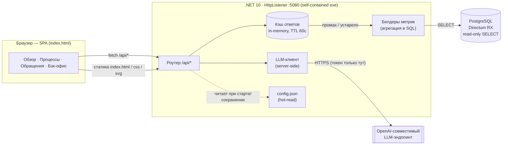
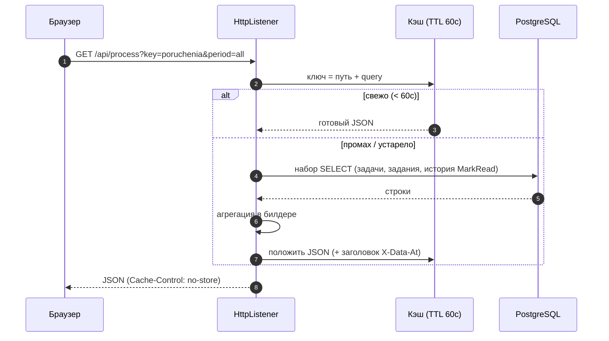
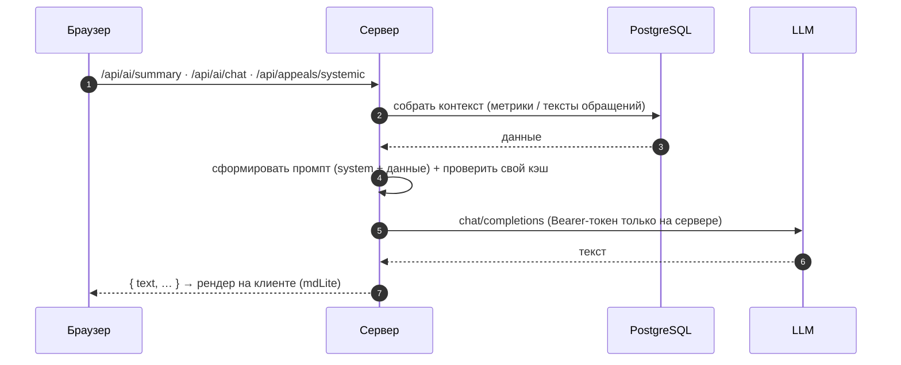
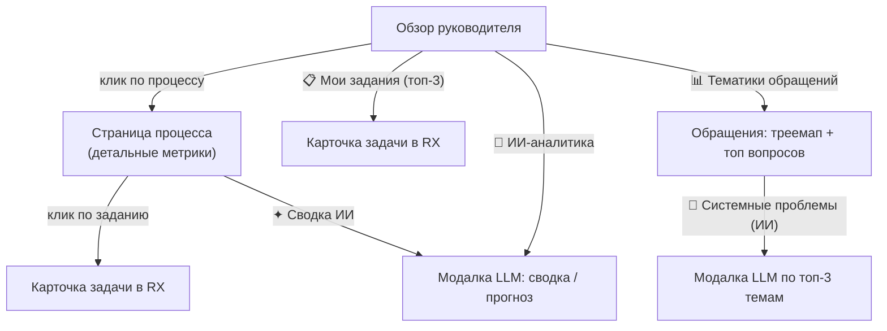

# АРМ руководителя — аналитика процессов (standalone)

Read-only веб-дашборд над БД Directum RX для первого лица: за 10 секунд понять состояние
процессов и провалиться в детали вплоть до конкретного поручения, исполнителя и ссылки в RX.
Поверх метрик — ИИ-сводка, чат, пояснения и разбор системных проблем по обращениям.
.NET 10, без установки в RX, **только `SELECT`**.

Охват: 3 процесса — **Поручения**, **Обращения граждан**, **НПА** — плюс сквозная аналитика тематик обращений.

---

## Как это работает

### Компонентная архитектура



### Поток запроса метрики (кэш перед БД)



### ИИ-сценарии (сводка / системные проблемы)



### Экраны и переходы



---

## Технические решения и логика бэка

- **Один self-contained .NET 10 exe + `index.html` рядом.** HTTP-сервер на `HttpListener` (:5080).
  `index.html` читается **на каждый запрос** — правка фронта не требует пересборки. Ничего не
  устанавливается в RX.
- **Только чтение.** Все билдеры делают `SELECT`; соединение `Npgsql` открывается **на каждый запрос**
  (без разделяемого состояния между запросами).
- **Кэш ответов** — in-memory `ConcurrentDictionary`, TTL 60с, ключ = `путь + query-string`.
  Снимает нагрузку с БД при навигации; сброс — кнопкой «Обновить данные» (`POST /api/refresh`).
  В ответе заголовок `X-Data-At` = время, на которое актуальны данные.
- **Исключение уведомлений.** Типы `*Notice / *Notification` подгружаются из `sungero_system_entitytype`
  при старте и **вычитаются из всех метрик** (иначе информирование искажает статистику работы).
- **Консистентность метрик** (значения не конфликтуют между собой и с сущностями):
  - единое определение возврата: «**с первого раза**» = без повтора этапа и без доработки, поэтому
    `FTR% + петли% ≈ 100%`;
  - явное разделение **задач** (`task`) и **заданий** (`assignment`) в подписях;
  - все временные границы считаются в SQL через `now()` (просрочка в KPI и в блоке риска совпадает);
  - воронка сходится к итогу: `завершено + в работе + просрочено + прервано = всего`.
- **LLM только на сервере.** Bearer-токен в браузер не уходит. Результаты кэшируются раздельно
  (общий контекст-бандл ~2 мин, сводки ~10 мин, системные проблемы ~30 мин) и вызываются
  **по кнопке**, а не на загрузке страницы.
- **Тексты обращений** для ИИ-разбора берутся из темы документа `sungero_content_edoc.name`
  (`Обращение от {ФИО} "{суть}"`). Фильтр «реальных обращений» отсекает служебные пересылки и тесты
  (`ilike 'Обращение%'`, без «направление на рассмотрение» / «тест», длина ≥ 80).
- **Профили-роли** (состав и порядок блоков) — **конфигурация**, а не жёсткий код; правятся в Бэк-офисе.
- **Конфиг** `config.json` рядом с exe: hot-read, секретов в коде нет, в браузер не возвращаются;
  env-override для Docker.

### Карта эндпоинтов

| Группа | Маршруты |
|---|---|
| Обзор | `GET /api/overview` · `GET /api/processes` · `GET /api/my/tasks` |
| Процесс | `GET /api/process` · `/process/stuck` · `/process/workload` · `/process/departments` · `/process/by-kind` · `/process/dept-tasks` · `/process/kind-tasks` |
| Обращения | `GET /api/appeals/topics` · `GET /api/appeals/systemic` (ИИ) |
| Детали | `GET /api/task` · `GET /api/performer` · `GET /api/export` |
| ИИ | `GET /api/ai/summary` · `POST /api/ai/chat` · `POST /api/ai/explain` |
| Служебное | `POST /api/refresh` · `GET/POST /api/config` · `POST /api/config/test` |

---

## Возможности

**Обзор для руководителя (главный экран).**
- Hero-полоса: **Соблюдение сроков** (доля в срок + дельта ▲▼ к прошлому месяцу), главное узкое
  горлышко (этап → медиана ожидания), застрявшие задания (долгострои).
- **📋 Мои задания** — топ-3 задания демо-руководителя (просроченные → с ближайшим сроком),
  клик открывает карточку задачи в RX.
- «🔥 Что горит сейчас» — топ процессов по тяжести.
- «🧠 ИИ-аналитика и прогноз» — сводка от LLM (по кнопке, модалка).
- Краткая аналитика тематик обращений.
- Светофор процессов (худшие сверху): здоровье, количество, узкое место, просрочка,
  спарклайн дисциплины, стрелка динамики. Клик → модалка-сводка процесса.

**Модалка-сводка процесса** (клик по процессу): KPI, распределение по подразделениям
(клик → список поручений), возвраты на доработку, загрузка исполнителей.

**Страница процесса** — детальная аналитика (см. «Метрики»). Блоки можно **перетаскивать**
(за ⠿) и менять **ширину** («на строку»); раскладка сохраняется в браузере (localStorage),
кнопка «↺ сбросить раскладку».

**Тематики обращений граждан** (отдельная страница): тепловая карта тематик (раздел → тема),
топ вопросов, «куда направлено», разделы классификатора; клик по теме → список вопросов.
Кнопка **«🧠 Системные проблемы (ИИ)»** — LLM читает тексты обращений по топ-3 темам
(среди тем с реальными обращениями) и выделяет системные проблемы + вывод по каждой.

**ИИ (LLM).** Сводка по региону и по процессу (кнопка «✦ Сводка ИИ»); чат-ассистент со всей
аналитикой в контексте и быстрыми промптами; «разбор от ИИ» по клику на значок ⓘ.
Вызовы LLM — только на сервере (токен в браузер не уходит).

**Профили-роли.** Переключатель в шапке (Руководитель / Контроль исполнения / Аналитик) —
у каждого свой набор и порядок блоков. Состав настраивается в Бэк-офисе.

**Период.** Месяц / квартал / год / весь период (фильтр по дате создания задач).

**Бэк-офис.** Настройка подключений (БД, модель, ссылка в RX), профилей (состав блоков),
порогов (цвета/долгострой), быстрых промптов чата.

**Экспорт и печать.** Кнопки «⬇ CSV» (просроченные, загрузка, подразделения) и «🖨 Печать».

---

## Какие метрики снимает дашборд

**По региону (обзор):**
- **Соблюдение сроков** — доля заданий «в срок» среди тех, чей срок уже наступил
  (`в срок ÷ (в срок + просрочено, включая активные просроченные)`), + дельта к прошлому месяцу.
- **Главное узкое горлышко** — пара (процесс → этап) с макс. медианой возраста активных заданий + очередь.
- **Долгострои** — активные задания, просроченные больше порога (по умолчанию > 3 дней).
- **Здоровье процесса** — `1 − просроченные_активные / активные`.
- **Мои задания** — топ-3 задания руководителя по срочности (просрочка → ближайший срок).

**По процессу:**
- **KPI** — всего задач / в работе / просрочено заданий / средний цикл / «95% проходят за» (P95 маршрута).
- **Воронка согласования** — объём по этапам (завершено / в работе / просрочено / **прервано**); разбивка сходится к итогу этапа.
- **Сколько длится каждый этап** — «обычно» (P50) и «в худшем случае» (P95) по завершённым заданиям этапа.
- **Длительность маршрута** — распределение задач по корзинам дней (0–7 … 180+).
- **Тренд дисциплины** — помесячно «вовремя / просрочено».
- **Прогноз срыва срока** — активные задания по близости к сроку (просрочено / ≤3 дн / ≤7 дн / норма); просрочка совпадает с KPI.
- **Топ по просрочкам**, **Лучшие исполнители** и **Сотрудники с наивысшим КПД** (доля в срок из «оценённых», порог по объёму — отделяет эффективность от объёма).
- **Переделки: кто возвращает / кто дольше держит** — переключатель: авторы возвратов на доработку («битва правок») ↔ рейтинг по медиане удержания документа; + варианты маршрута.
- **Время и качество решения** — медиана цикла, «открыл → решил», флаг «пустого согласования».
- **На что уходит время: работа или ожидание** — доля реальной работы vs ожидания в очереди (по событиям открытия).
- **Скорость реакции** — «создано → взято в работу» (ведём по медиане + доля быстрых и «хвост»).
- **С первого раза** — доля задач без единого возврата/повтора этапа (согласовано с блоком «Петли»).
- **Петли** — доля задач с повторным прохождением этапа + частые переходы между этапами.
- **Приток / отток** — поступило vs завершено по месяцам (растёт ли завал).
- **Загрузка исполнителей** — вовремя / в работе / просрочено + признак перегруза.
- **Просроченные задания** — гистограмма по длительности просрочки (клик → список → маршрут).
- **Разрезы** — по исполнителю / ведомству / виду рассмотрения.
- **Карточка задания** — маршрут по этапам (текущий подсвечен) + ссылка в RX.

**По обращениям граждан:**
- **Тематики** — KPI (обращений/вопросов, в среднем на обращение, доля многовопросных), тепловая карта разделов и тем, топ вопросов, «куда направлено».
- **Системные проблемы (ИИ)** — по топ-3 темам (с реальными обращениями) LLM выделяет повторяющиеся проблемы и вывод для руководителя.

**Источники данных (read-only):** `sungero_wf_task`, `sungero_wf_assignment`,
`sungero_core_recipient` (+ подразделение), `sungero_wf_workflowhistory` (событие `MarkRead`),
`sungero_system_entitytype` (исключение уведомлений); обращения — `gd_citizen_reqquestions`,
`gd_citizen_classifierbase`, `sungero_content_edoc`, `sungero_parties_counterparty`.
ИИ — внешний OpenAI-совместимый эндпоинт.

---

## Запуск

**На любой машине Windows x64 (готовый бандл, .NET ставить не нужно):**
1. Собрать бандл: `dotnet publish -c Release -r win-x64 --self-contained true -o dist`
2. Скопировать папку `dist/` (плюс при необходимости `config.json` — см. ниже) на целевую машину.
3. Запустить **`run.bat`** (поднимет сервер, дождётся готовности и откроет браузер) или напрямую `dist\armgov-standalone.exe`.
4. Открыть `http://localhost:5080/`.

> `run.bat` в ASCII-кодировке (иначе `cmd.exe` спотыкается о кириллицу), ждёт готовности порта
> перед открытием браузера и не плодит второй инстанс.

Сетевые требования (данные тянутся вживую): доступ к PostgreSQL и к LLM-эндпоинту
(адреса задаются в Бэк-офисе). Без сети страница откроется, но метрики/ИИ не загрузятся.

## Бэк-офис и конфигурация

Подключения берутся из **`config.json`** рядом с exe (в `.gitignore`, в репозиторий не попадает).
Редактируется в вебе (раздел **«⚙ Бэк-офис»**): БД, модель, ссылка в RX, профили, пороги, промпты.
Кнопка «Проверить подключение» пингует БД и модель. Секреты в браузер не возвращаются
(маскируются); пустое поле = «не менять». В исходном коде секретов нет.
Переопределение через env (для Docker): `ARMGOV_PREFIX`, `ARMGOV_DB_PASSWORD`, `ARMGOV_LLM_TOKEN`.

Пример `config.json`:
```json
{
  "Prefix": "http://localhost:5080/",
  "RxBase": "http://<rx-host>/Client/#/",
  "Db":  { "Host": "<host>", "Port": "5432", "Database": "<db>", "Username": "<user>", "Password": "<pass>" },
  "Llm": { "Url": "https://<llm>/v1/chat/completions", "Model": "<model>", "Token": "<token>" }
}
```

## Docker

```
docker build -t armgov-dashboard .
docker run -p 5080:5080 -e ARMGOV_DB_PASSWORD=*** -e ARMGOV_LLM_TOKEN=*** armgov-dashboard
```
или `docker compose up --build` (см. `docker-compose.yml`). В контейнере слушается `http://*:5080/`.
Секреты в образ не зашиваются.

## Сборка для разработки

Нужен .NET 10 SDK.
```
dotnet build -c Release
bin\Release\net10.0\armgov-standalone.exe
```
`index.html` читается при каждом запросе — после правки фронта достаточно скопировать его
в выходную папку: `copy index.html bin\Release\net10.0\index.html`.

Ad-hoc запросы к БД — утилита `tools/dbq` (см. `tools/dbq/QUERIES.md`).

## Тесты

`python tests/smoke.py [http://localhost:5080]` — функциональный smoke-тест (без зависимостей):
проверяет все `/api/*`-эндпоинты и ключевые поля метрик. Секция ИИ выполняется отдельно
(нужен доступный LLM); при недоступности фиксирует graceful-ошибку.

---

## Дорожная карта

Полная карта — **[docs/roadmap.md](docs/roadmap.md)** (по итогам демо с заказчиком, 02.07.2026;
AI-трек ведётся отдельно). Кратко:

**Ближайший горизонт**
- Расписать все метрики (описание + скриншоты) на согласование.
- Гибкие фильтры «что считаем» (по важности / контролю; исключение типов заданий и исполнителей).
- Прототип роли в иерархии (фильтрация по ведомству), уточнение метрики «формального согласования» (согласовано без открытия документа).

**Средний горизонт**
- Теги / «Мои проекты» / личные пометки с фильтрацией; особый контроль (указы Президента, СВО).
- Вес и неравнозначность поручений в метриках.
- Ролевые профили: Губернатор / Зам губернатора / Руководитель ОИВ с разными наборами метрик.

**Дальний горизонт**
- Экономический эффект «до / после» на крупном процессе-витрине.
- Залипшие задания, ручная приоритизация, полная настраиваемость визуализации.

---

## Структура

- `Program.cs` — backend: HTTP-сервер (HttpListener), все `/api/*`-эндпоинты, кэш, конфиг, вызовы LLM.
- `index.html` — весь фронтенд (SPA, офлайн SVG/CSS): обзор, процессы, обращения, ИИ, Бэк-офис, раскладка.
- `tokens.css`, `logo-directum.svg` — дизайн-система Platform.ОГВ/Directum.
- `lib/` — вендоренные сборки (`Npgsql`, `Microsoft.Extensions.Logging.Abstractions`), в репозитории.
- `tools/dbq/` — CLI для ad-hoc SQL-запросов к БД (диагностика/проверка гипотез).
- `tests/smoke.py` — функциональный тест. `run.bat`, `Dockerfile`, `docker-compose.yml`, `.dockerignore`.
- `config.json` — подключения с секретами (в `.gitignore`; задаётся через Бэк-офис).
- `docs/` — `roadmap.md` (дорожная карта), `demo-script.md`, спецификации. `dist/` — собранный бандл (артефакт, не в git).
- Сопутствующая документация: `PROJECT-OVERVIEW.md` (позиционирование/риски), `TECHNICAL.md` (тех. детали).
