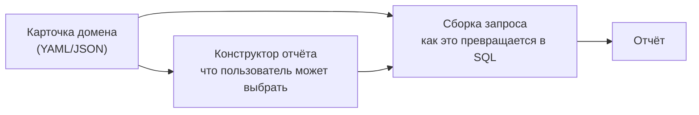
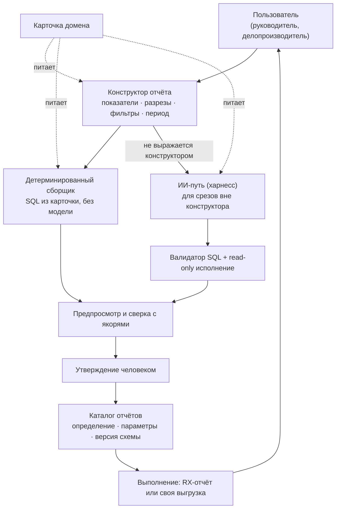

# Генератор отчётов над Directum RX — архитектура

**Статус:** проработка направления, до реализации. Живой документ.
**Основание:** работающий ИИ-харнесс прототипа (`Program.cs`, регион «ИИ-харнесс») и подсистема отчётов RX (`knowledge-base/guides/13_reports.md`).

---

## 1. Задача

Пользователь в рамках предметной области сам выбирает, какие данные ему нужны, а продукт собирает отчёт: считает, показывает, выгружает, при необходимости повторяет по расписанию.

Ключевое слово — **сам**. Не «сформулировал задачу аналитику», не «открыл DDS», а выбрал из того, что ему предложили, и получил результат.

### Чем это отличается от «ИИ, который пишет SQL»

Формулировка «дадим модели схему базы, и она напишет запрос» воспроизводится за выходные и не работает на продуктиве. Мы это измерили на своём же стенде: если дать модели только структуру таблиц, на вопросе «сколько заданий просрочено» она уверенно отвечает **2608**, потому что честно считает по всей `sungero_wf_task`. На экране дашборда в этот момент — **810**.

Разница не в модели и не в промпте. Разница в том, что в базе нет ответов на вопросы «что считать просрочкой», «какие задачи относятся к поручениям» и «когда дедуплицировать по корневой задаче». Это знание живёт в коде дашборда и в голове аналитика.

Отсюда центральный тезис архитектуры:

> Продукт — это не генератор SQL. Продукт — это **описанная предметная область Directum RX**, на которой генерация SQL становится предсказуемой.

---

## 2. Центральная идея: карточка домена как единственный источник правды

Карточка домена — машиночитаемое описание предметной области. Она обслуживает **два потребителя сразу**, и в этом вся конструкция:



Одно описание задаёт и меню для пользователя, и правила построения запроса. Они не могут разъехаться, потому что это один файл.

Второе важное свойство: **карточка пишется на домен, а не на отчёт**. Описали «поручения» — и все отчёты по поручениям (просрочка по НОР, динамика по месяцам, соисполнители, долгострои) берут её же. Стоимость продукта измеряется числом доменов, а не числом отчётов.

---

## 3. Слои архитектуры



Порядок слоёв выбран так, чтобы модель участвовала как можно реже и как можно раньше — на этапе проектирования отчёта, а не на этапе его выполнения.

---

## 4. Карточка домена

### 4.1 Формат

Сейчас в прототипе словарь схемы — связный текст для промпта (~1130 токенов, 12 таблиц из 657 в схеме `public`). Для генератора отчётов он должен стать **структурированным**: из прозы нельзя построить меню выбора.

Предлагаемый состав (YAML как пример носителя):

```yaml
domain: poruchenia
title: Поручения
stand_calibrated: true          # см. 4.3

base:                            # скелет, общий для всех запросов домена
  from: sungero_wf_assignment a
  joins:
    - join sungero_wf_task t on a.task = t.id
  where:                         # то, что применяется ВСЕГДА
    - "t.discriminator = :anchor_poruchenia"
    - "a.discriminator not in (:notice_types)"   # уведомления исключаются

anchors:                         # якорные значения, свои на каждом стенде
  anchor_poruchenia: 'c290b098-12c7-487d-bb38-73e2c98f9789'

dimensions:                      # разрезы — то, что пользователь ставит в строки
  - name: performer
    title: Исполнитель
    sql: "rc.name"
    requires_join: "join sungero_core_recipient rc on rc.id = a.performer"
  - name: unit
    title: НОР
    sql: "bu.name"
    requires_join: "join sungero_core_recipient rc on rc.id = a.performer
                    join sungero_core_recipient bu on bu.id = rc.emplbunit_company_sungero"
  - name: month
    title: Месяц
    sql: "date_trunc('month', t.created)"

measures:                        # показатели — то, что пользователь ставит в колонки
  - name: overdue
    title: Просрочено
    sql: "count(*) filter (where a.status = 'InProcess'
                             and a.deadline is not null
                             and a.deadline < now())"
  - name: on_time_pct
    title: Соблюдение сроков, %
    sql: "round(100.0 * count(*) filter (where a.status = 'Completed'
                                           and a.completed is not null
                                           and a.deadline is not null
                                           and a.completed <= a.deadline)
                / nullif(count(*) filter (where a.status = 'Completed'), 0), 1)"
  - name: avg_overdue_days
    title: Средняя просрочка, дней
    sql: "round((avg(extract(epoch from (now() - a.deadline)) / 86400))::numeric, 1)"

filters:
  - name: period
    title: Период
    type: daterange
    sql: "t.created >= :begin_date and t.created < :end_date"
  - name: unit
    title: Подразделение
    type: entity_ref
    sql: "rc.emplbunit_company_sungero = :unit_id"

traps:                           # ловушки — для ИИ-пути и для ревью карточки
  - "assigneetai_recman_sungero и supervisor_recman_sungero существуют, но дашборд
     их не использует: все разрезы по людям идут через a.performer"
  - "дедупликация по maintask — только для персональных списков; в агрегатных
     показателях она занижает просрочку почти на треть"

validation_anchors:              # критерий готовности, см. 4.4
  - measure: overdue
    filters: {}
    expected: 635
    source: "/api/overview → processes[poruchenia].overdue"
```

Обратите внимание: `measures` — это не названия, а **формулы**. Правило расчёта перестаёт быть текстом в промпте и становится исполняемым определением. Именно поэтому по карточке можно собрать SQL без участия модели.

### 4.2 Три слоя внутри карточки

| Слой | В карточке | Откуда берётся | Автоматизируемо |
|---|---|---|---|
| Структура | `base`, `joins`, `requires_join` | интроспекция БД | да |
| Якорные значения | `anchors` | разбор данных стенда | частично |
| Правила расчёта | `measures`, `traps` | код дашборда, аналитик | нет |

Третий слой — самый дорогой и единственный, который нельзя купить или сгенерировать. Он же и есть продукт.

### 4.3 Калибровка на стенде

Главный архитектурный риск прототипа (зафиксирован в `CLAUDE.md`): опознание процессов завязано на конкретный стенд — GUID-дискриминаторы и эвристики по тексту темы. На другой инсталляции или после обновления платформы аналитика поедет молча.

Карточка решает это разделением на **шаблон** и **якоря**:

- шаблон (структура, показатели, правила) переносится между стендами как есть;
- `anchors` определяются при установке — процедурой калибровки, которая ищет значения по эталонным признакам и показывает найденное человеку на подтверждение;
- пока калибровка не пройдена, `stand_calibrated: false`, и отчёты по домену **не выполняются**, а не выполняются с неверными числами.

Это превращает главный риск из «однажды тихо сломается» в «не запустится, пока не настроят».

### 4.4 Критерий готовности карточки

Карточка считается готовой не когда «всё описано», а когда по ней воспроизводятся известные числа. `validation_anchors` — это самотест: сборщик строит запрос по карточке и сверяет с эталоном.

На нашем домене это выглядело так и должно стать автоматической проверкой:

```
поручения   635 / 635
обращения   147 / 147
НПА          28 /  28
```

Пока не сходится — карточка неполна, и видно, чего именно не хватает. Описание предметной области становится инженерным артефактом с тестом, а не эссе.

---

## 5. Конструктор отчёта

Экран, собранный из карточки. Пользователь выбирает:

| Что выбирает | Из чего | Пример |
|---|---|---|
| Домен | каталог карточек | Поручения |
| Показатели | `measures` | Просрочено, Соблюдение сроков % |
| Разрезы | `dimensions` | НОР, Месяц |
| Фильтры | `filters` | Период: квартал; Подразделение: ДИТ |
| Сортировка и лимит | производные | по просрочке убыв., топ-20 |

Свободный текст остаётся, но как **ускоритель, а не основной путь**: «просрочка по НОР за квартал» → конструктор заполняется заготовкой, пользователь проверяет и правит. Это принципиально надёжнее, чем текст → SQL напрямую: модель выбирает из закрытого списка, а не сочиняет.

Тут же — предпросмотр результата на реальных данных, до всякого сохранения.

---

## 6. Два пути генерации запроса

### 6.1 Детерминированный сборщик (основной)

Если пользователь выбрал только то, что есть в карточке, SQL собирается кодом:

```
SELECT  <dimensions.sql>, <measures.sql>
FROM    <base.from> <base.joins> <requires_join выбранных разрезов>
WHERE   <base.where> AND <filters выбранных>
GROUP BY <dimensions>
ORDER BY <выбранное>  LIMIT <выбранное>
```

Модель не участвует вовсе. Следствия: отчёт воспроизводим до бита, формируется за секунды, не зависит от доступности LLM и ничего не стоит за вызовы. По нашей оценке этим путём закрывается большинство типовых отчётов.

### 6.2 ИИ-путь (для остального)

Когда нужного среза в карточке нет — сравнение периодов, оконные функции, нетиповая когорта — включается уже работающий харнесс: карточка идёт в промпт как словарь, модель пишет запрос, валидатор проверяет, read-only транзакция исполняет, ошибки БД возвращаются модели для самокоррекции.

Измеренное поведение на нашем стенде: вопрос про среднюю просрочку модель решила за три итерации внутри одного ответа — `avg` от интервала, затем `round` от `double precision`, затем корректный вариант с приведением к `numeric`. Пользователь видит только результат, а весь путь — если развернёт протокол шагов.

**Обратная связь, замыкающая контур:** удачный запрос ИИ-пути после утверждения можно продвинуть в карточку как новый `measure`. Тогда в следующий раз тот же срез соберётся детерминированно. Карточка растёт от использования, а доля ИИ-пути падает.

### 6.3 Жёсткое правило про арифметику

Любое вычисление — внутри SQL. Модель не считает в ответе.

Основание из практики: в чате на вопрос «во сколько раз просрочка по поручениям больше, чем по обращениям» модель поделила 635 на 147 в уме. Ответ оказался верным, но проверять его было нечем — в протоколе не было ни запроса, ни инструмента. Для чата это приемлемо, для отчёта, по которому принимают решения, — нет.

---

## 7. Предпросмотр, сверка и утверждение

Три обязательных шага между «собрали» и «сохранили»:

1. **Предпросмотр** — запрос выполняется на реальных данных, показывается таблица.
2. **Сверка с якорями** — там, где отчёт пересекается с известной метрикой дашборда, числа сверяются автоматически. Если отчёт «просрочка по подразделениям» в сумме не даёт 810, он не утверждается.
3. **Утверждение человеком** — с фиксацией, кто и когда. Это не бюрократия: ошибка в чате стоит переспроса, ошибка в отчёте руководителю стоит решения.

---

## 8. Каталог отчётов

Сохраняется **определение**, а не только текст запроса:

| Поле | Зачем |
|---|---|
| выбор пользователя (домен, показатели, разрезы, фильтры) | чтобы отчёт можно было открыть и поправить в конструкторе |
| сгенерированный SQL с именованными параметрами | то, что реально исполняется |
| параметры и их типы | для формы запуска и для RX-отчёта |
| версия карточки и отпечаток схемы | чтобы поймать расхождение после обновления платформы |
| кто утвердил и когда | ответственность за цифры |
| якоря сверки | самотест при каждом запуске |

Отчёт, у которого отпечаток схемы разошёлся с текущим, помечается как требующий перепроверки и не рассылается молча.

---

## 9. Выполнение и доставка

Строить рендеринг, экспорт и расписание не нужно — это есть в платформе. Отчёт RX включает параметры, **источник данных типа «SQL-запрос» с именованными параметрами**, макет с бэндами, таблицами и диаграммами, события до и после выполнения, экспорт в PDF, Word, Excel (`knowledge-base/guides/13_reports.md`).

Отсюда стык: наш продукт производит **SQL с параметрами**, RX его потребляет как источник данных.

Два режима, и оба нужны:

| Режим | Когда | Что даёт |
|---|---|---|
| Отчёт RX | регулярная отчётность, рассылка, печатные формы | расписание, права, макеты, экспорт — всё платформенное |
| Своя выгрузка | разовый срез «здесь и сейчас» | таблица на экране и xlsx в один клик, без DDS |

Макет для режима RX собирает человек в дизайнере; модель может предложить черновик структуры колонок, но это последнее по приоритету — генерация макетов целиком плохая ставка.

---

## 10. Безопасность

Переносится из харнесса без изменений, здесь она тем более обязательна: сохранённый запрос будет запускаться по расписанию без человека.

- **Только `SELECT`** — нерушимое правило; валидатор: один оператор, начало с `SELECT`/`WITH`, разбор строковых литералов, два списка запретов (ключевые слова по границам слова, семейства функций по префиксу), безусловная обёртка в `limit`.
- **Read-only транзакция** с `statement_timeout` — второй рубеж на стороне PostgreSQL.
- **Запрет таблиц с учётными данными** (`pg_authid`, `pg_shadow`, `pg_user`, `pg_roles`) и ограничение справки по схеме таблицами прикладной области.
- **Отдельная учётка БД только на чтение** — обязательна перед выходом за пределы демо-контура. Сейчас между обходом валидатора и записью стоит только транзакция, которую выставляет наш же код.
- Детерминированный путь (6.1) в этом смысле безопаснее по построению: пользователь не влияет на текст SQL, только на выбор из карточки.

---

## 11. Роли и процесс

| Роль | Что делает | Как часто |
|---|---|---|
| Аналитик предметной области | пишет и калибрует карточку домена | один раз на домен |
| Методолог / владелец данных | утверждает отчёт и его цифры | на каждый новый отчёт |
| Пользователь | собирает отчёт в конструкторе, запускает | постоянно |
| Разработчик | макеты RX, продвижение ИИ-запросов в карточку | по мере роста каталога |

Узкое место — утверждение. Его стоит проектировать сразу: массовые однотипные отчёты внутри уже утверждённых показателей разумно пропускать без повторного согласования, а требовать его только для ИИ-пути и новых показателей.

---

## 12. Этапы

**Этап 1. Один отчёт целиком.** Домен поручений (карточка уже почти готова — есть словарь и правила), конструктор из трёх показателей и двух разрезов, детерминированный сборщик, предпросмотр, выгрузка в xlsx. Проверяемая гипотеза: руководитель получает нужную выгрузку, не открывая DDS и не обращаясь к аналитику.

**Этап 2. Каталог отчётов и параметры.** Сохранение определений, повторный запуск, именованные параметры, отпечаток схемы.

**Этап 3. Стык с RX.** SQL-источник + макет + расписание и рассылка средствами платформы.

**Этап 4. ИИ-путь и рост карточки.** Нетиповые срезы через харнесс, продвижение удачных запросов в показатели карточки.

**Этап 5. Второй домен.** Обращения граждан или договоры — проверка того, что стоимость домена действительно амортизируется, а конструктор не пришлось переписывать.

Порядок не случаен: ИИ-путь идёт четвёртым, хотя технически готов уже сейчас. Сначала нужно доказать, что детерминированный путь закрывает большинство задач — иначе продукт превратится в «ИИ пишет SQL», со всеми его проблемами воспроизводимости.

---

## 13. Риски и открытые вопросы

| Риск | Смягчение |
|---|---|
| Семантический слой не масштабируется дёшево: 12 таблиц из 657, каждый домен описывается вручную | Стоимость на домен, а не на отчёт; шаблон карточки; продвижение ИИ-запросов в показатели |
| Дрейф схемы после обновления платформы | Отпечаток схемы в определении отчёта, калибровка якорей, блокировка некалиброванного домена |
| Утверждение становится узким местом | Разные режимы: без согласования внутри утверждённых показателей, с согласованием для ИИ-пути |
| Тяжёлый запрос на боевой базе | `statement_timeout`, лимиты строк, предпросмотр на ограниченной выборке, оценка плана перед сохранением |
| Пользователь соберёт бессмысленный срез | Карточка ограничивает сочетания: показатель может объявлять, с какими разрезами он осмыслен |
| Расхождение с экраном дашборда | Общая карточка для дашборда и отчётов — целевое состояние; показатели дашборда переезжают в неё же |

**Открытые вопросы, требующие решения до реализации:**

1. Носитель карточки — файл в репозитории или запись в БД с редактором в бэк-офисе? Файл проще версионировать, запись проще править заказчику.
2. Кто владеет карточкой у заказчика после передачи продукта — и хватит ли ему квалификации её расширять.
3. Нужен ли конструктору свободный текст на первом этапе или он отвлекает от проверки основной гипотезы.
4. Общий ли слой показателей у дашборда и отчётов — или отчёты живут на своей копии. Общий правильнее, но требует рефакторинга сборщиков прототипа.

---

## 14. Что уже готово и переносится

Не с нуля: нижняя половина конструкции работает и проверена на стенде.

| Компонент | Состояние |
|---|---|
| Словарь схемы и правила расчёта домена поручений | готов, сверен: 635 / 147 / 28 |
| Валидатор SQL | готов, дважды проревьюирован и пробит на обход |
| Исполнение в read-only с таймаутом и лимитами | готово |
| Цикл с самокоррекцией по ошибкам БД | готов, работает на живых вопросах |
| Каталог инструментов поверх сборщиков дашборда | готов, 9 инструментов |
| Протокол шагов как обоснование цифры | готов, показывается в интерфейсе |

Недостающее — это конструктор, структурированная карточка, детерминированный сборщик, каталог отчётов и стык с подсистемой отчётов RX.
